__Cool Picture__: 

```
Cool Link:
```

[My Index Page](https://henohyj.github.io/cse15l-lab-reports/index.html)


# Installing VS Code:

Google “VS Code”, find the official website, and download the .exe file of corresponding controlling system to your computer. Then click it and follow the steps to complete the installation.

This is what Visual Studio Code's official website looks like:
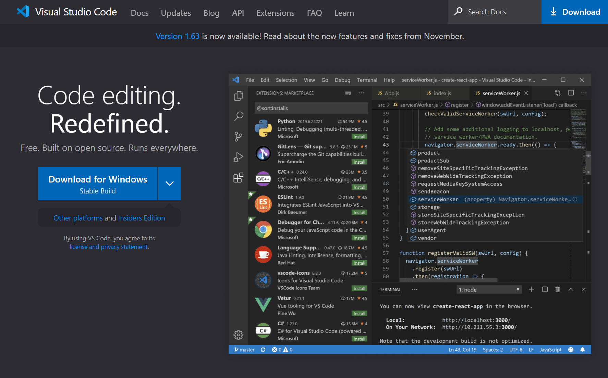

Here's the link for downloading Win64x version VS Code:
[VS Code Download](https://code.visualstudio.com/docs/?dv=win64user)


# Remotely Connecting:

Type the command 
```
cs15lwi22zz@ieng6.ucsd.edu:~/
```
and remember to replace the “zz” with the correct letters of your account.

Then it should display something like this:

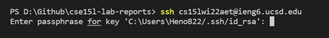

Then, type in your password of your account, it’s normal that you tap your keyboard but nothing shows up, just type in the password and press enter.

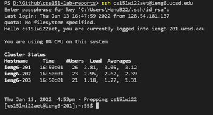

If you see similar messages above, it means that you successfully connect to the remote server.


# Trying Some Commands:

You can try playing around with some commands like me:
```
ls 
mkdir hello
cd ..  or  cd ~
cp filename hello
```
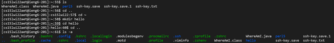

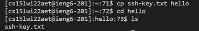


# Moving Files with scp:

Next, you will learn how to copy a file from your pc to the server, by using the “scp” command.

(Remember to use ```exit``` or Ctrl+D to return to your device)
```
scp filename cs15lwi22zz@ieng6.ucsd.edu:~/
```
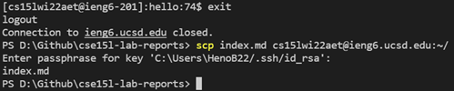

And log back into the server to check the file:

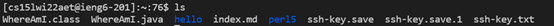

Now you can see I successfully copied a file “index.md” from my pc to the remote server


You can also run code on the server, just type in javac and java like on your pc:

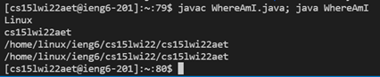

This WhereAmI.java is a file I previously put in, and it prints out some information about the device you are using.


# Setting an SSH Key:

You will find every time if you want to communicate to the server from your pc, it asks you to type in the password. By setting the ssh key can solve this inconvenience. 


If you are Windows system, please definitely follow what I did following:

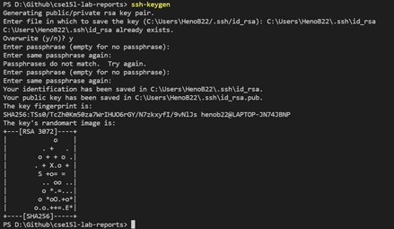

Please directly copy the path from your explorer or it cannot correctly recognize the file path.

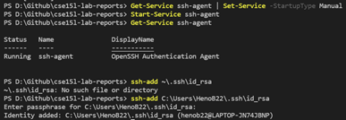


Then, you log back into the server to create a new directory by using the following command:
“mkdir .ssh”

Then go back on the client (your pc) to run this command

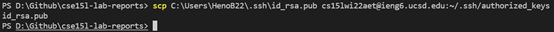

# Optimizing Remote Running:

Now you can see that you are no longer need type your password every time to communicate with the server from the client:

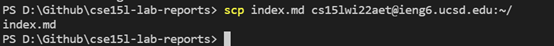


(You can also use semicolons to divide several commands that you want to run in the same line)

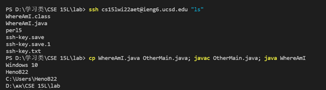
