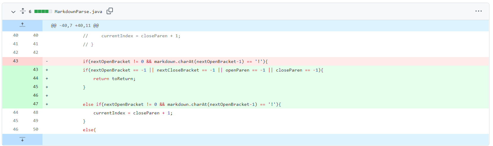

[My Index Page](https://henohyj.github.io/cse15l-lab-reports/index.html)

# Case 1:

Code change:


The __failure inducing input__ that prompts to make this change:

[Test File that prompts to do this change](https://github.com/HenoHyj/markdown-parse/commit/1157a66cf6a03aa229a10731e7b166e30a8afbc9#diff-0c92bd76ced9af0776068509abb9bde38fd5df23e64e0fba86f44cdf0c4a6f32)


__Symtom__ of such __failure inducing input__:


the code's version when showing such symptom:

[Bug Code 1](https://github.com/HenoHyj/markdown-parse/commit/6046c2b5e7b689dc4156459dd0ae8e600588b389)


Explanation:

We can see the __symptom__ is that the output includes the image link, which is not expected. The __bug__ in the code is that it doesn't
consider the situation if the markdown file has image links in it; the original version cannot distinguish difference between these
two types of link, which is the __failure inducing input__, and result in an incorrect output, which is the __symptom__ we saw.
The modified code distinguishes two links by checking the "!", and successfully excludes the image link from the output.

# Case 2:

Code Change:



The __failure inducing input__ that prompts to make this change:

[Test File that prompts to do this change](https://github.com/HenoHyj/markdown-parse/commit/62ad11982043f9d89b5366b88520012e91d61460)


__Symtom__ of such __failure inducing input__:


the code's version when showing such symptom:

[Bug Code 2](https://github.com/HenoHyj/markdown-parse/commit/85733cffcac8dea2a09fbbae5af45d731d83783d)

Explanation:

We can see that the __symptom__ is a StringIndexOutOfBoundsException has been thrown. The __bug__ in the 
code is that it doesn't count the situation if there are other texts that don't have "[]" or "()"; and
the __failure inducing input__ is a non-link message at the end of the markdownfile. This results in 
```markdown.indexOf()``` couldn't find the index of brackets or parentheses and returns a -1, therefore, 
when ```markdown.substring()``` is called, the StringIndexOutOfBoundsException will be thrown.


# Case 3

Code Change:


The __failure inducing input__ that prompts to make this change:

[Test File that prompts to do this change](https://github.com/HenoHyj/markdown-parse/commit/c6ef37f47c38f380b0dedcb3d63e404bf4842ca9)


__Symtom__ of such __failure inducing input__:


the code's version when showing such symptom:

[Bug Code 3](https://github.com/HenoHyj/markdown-parse/commit/62ad11982043f9d89b5366b88520012e91d61460)


Expanation:

We can see the __symptom__ is that the output includes the text "This is not a link", which is not expected. 
The __bug__ in the code is that it doesn't check if the text inside the legal parentheses is in common website
link format; and the __failure inducing input__ is "This is not a link" inside the legal parentheses.
The updated code will now check the content inside the legal parentheses and ensure it's in a common 
website link format (like "https://"), then adds the content into the output.