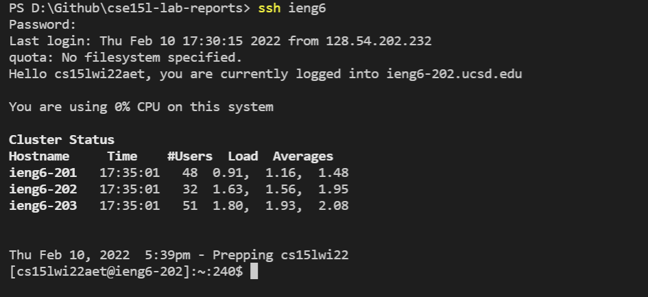

[My Index Page](https://henohyj.github.io/cse15l-lab-reports/index.html)

# Streamlining ssh Configuration:

First, create a ```config``` file in ```~/.ssh/config```. ```config``` is a file that doesn't have a file extension, 
you can create it by creating a file with any file type, rename it to "config" and delete its extension.

Then, use Notepad to open the ```config``` file (I suppose Mac also has similar file editor to open it), and type in following:

```
Host ieng6
    HostName ieng6.ucsd.edu
    User cs15lwi22zzz (use your username)
```

Just like this:


You can actually change the text after ```Host``` into any alias you like

Now, you can log in the ieng6 server by using this command ```ssh ieng6```

(replace "ieng6" with your alias if you choose different alias)


You may expect to see similar outputs like this:




Now, this "ieng6" can be an equivalent replacement for ```cs15lwi22aet@ieng6.ucsd.edu``` for me, when running commands that involves
typing in that long text.

Try using ```scp``` to copy a file now:


Logging back into the server, we can see that I successfully copy a file on my laptop to the server 
by using simplified command ```scp anotherMD.md ieng6:~/```.


Apparently, it's much shorter to type in and easier to remember.