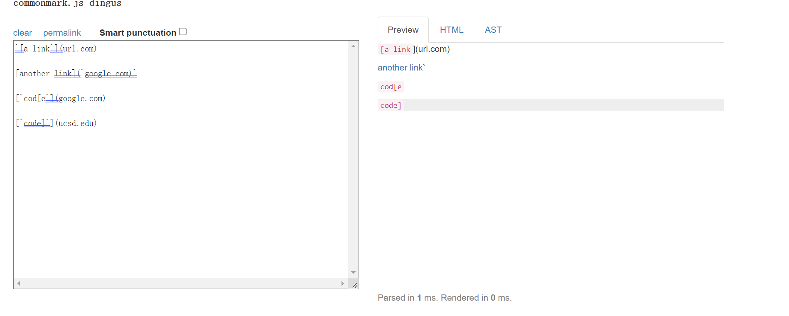
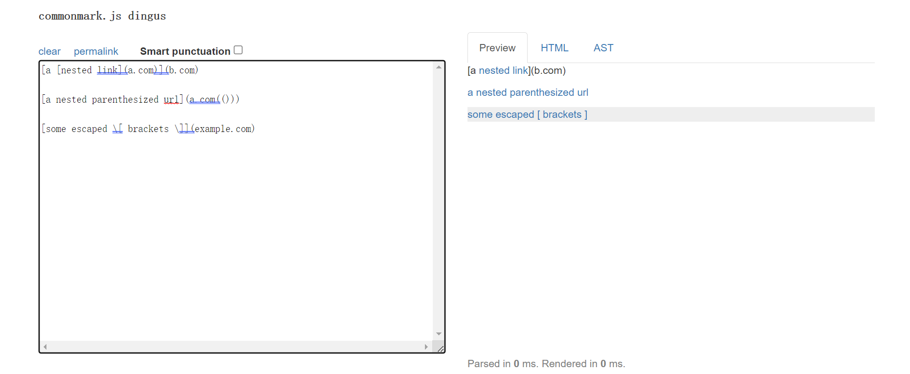
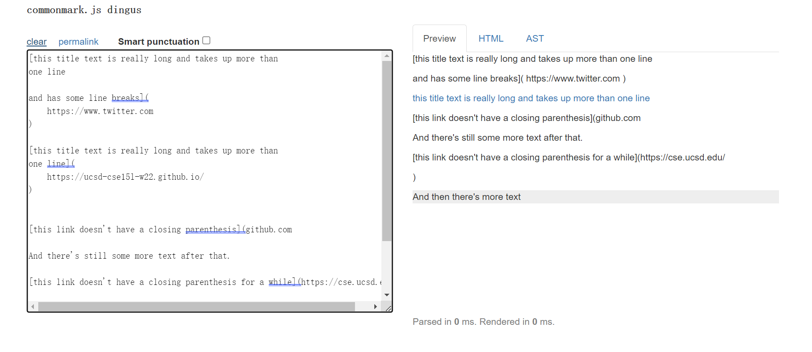
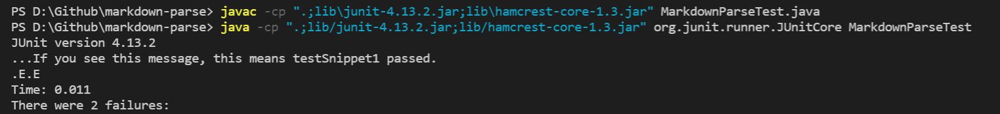
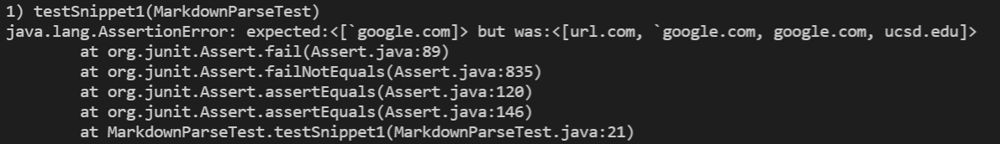
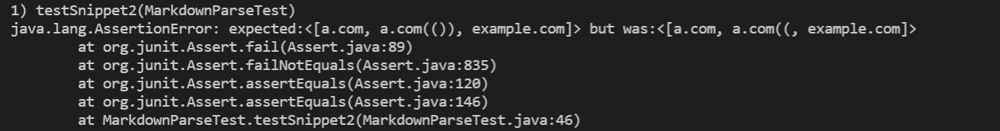
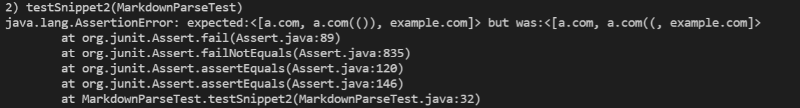
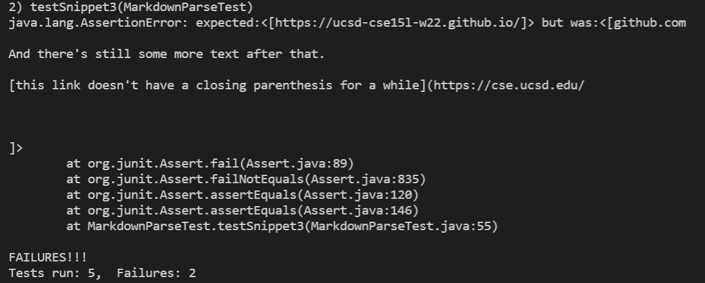
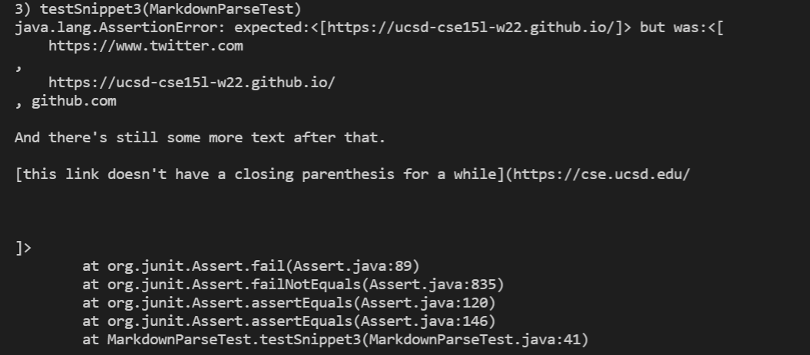

[My Index Page](https://henohyj.github.io/cse15l-lab-reports/index.html)


[Link to my markdown-parse repository](https://github.com/HenoHyj/markdown-parse)

[Link to the markdown-parse repository I reviewed](https://github.com/zfxd/markdown-parse)

# What should be produced by each snippet:

Snippet1:



The link for "`google.com", "google.com", "ucsd.edu" take effects


Snippet2:



The link for "a.com", "a.com(())", "example.com" take effects.


Snippet3:



Only the link for "https://ucsd-cse15l-w22.github.io/" takes effect.


# Test Code:
The new adding test methods are exactly the same for my implementation and the implementation I reviewed.
```
@Test
    public void testSnippet1() throws IOException {
        Path fileName = Path.of("snippet1.md");
	    String contents = Files.readString(fileName);

        assertEquals(List.of("`google.com", "google.com", "ucsd.edu"), 
        MarkdownParse.getLinks(contents) );

        System.out.println("If you see this message, this means testSnippet1 passed.");
    }

    @Test
    public void testSnippet2() throws IOException {
        Path fileName = Path.of("snippet2.md");
	    String contents = Files.readString(fileName);

        assertEquals(List.of("a.com", "a.com(())", "example.com"), 
        MarkdownParse.getLinks(contents) );

        System.out.println("If you see this message, this means testSnippet2 passed.");
    }

    @Test
    public void testSnippet3() throws IOException {
        Path fileName = Path.of("snippet3.md");
	    String contents = Files.readString(fileName);

        assertEquals(List.of("https://ucsd-cse15l-w22.github.io/"), 
        MarkdownParse.getLinks(contents) );

        System.out.println("If you see this message, this means testSnippet3 passed.");
    }
```

These 3 test methods for each code, totally 6 test methods are added.

Notice that I added a print statement at the end of each test method, so that I can have
an output message showing that I passed a particular test.


# Snippet 1:

Test in my implementation:


This test successes.


Test in the implementation I reviewed:


It fails.

# Snippet 2:

Test in my implementation:


This test fails. I think it cannot be solved by a code within 10 lines. My thought of fixing snippet 2 
and all related cases that nest parentheses, is to count the parentheses and brackets to check if they 
form legal pairs, and this at least requires two loops with multiple Ifs, to fulfill the goal of counting number
brackets and parentheses and determine if they forms a legal link text.


Test in the implementation I reviewed:


It also fails. 


# Snippet 3:

Test in my implementation:


This test fails. I think a code change within 10 lines are able to solve for snippet 3 and and all 
related cases that have newlines in brackets and parentheses. We just need to check if the content in
brackets and parentheses contains empty line. One or two Ifs may able to achieve that.


Test in the implementation I reviewed:


It also fails.