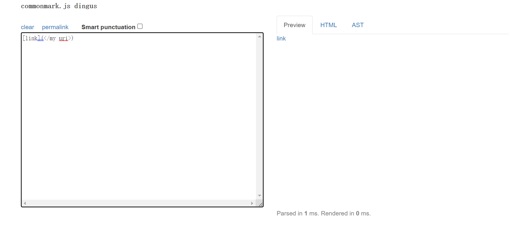

[My Index Page](https://henohyj.github.io/cse15l-lab-reports/index.html)

By using ```diff``` command, I can directly check the differences between the two results.txt, one produced by my
implementation and another produced by Joe's implementation(```markdown-parse:510$ diff JoeResults.txt  ../myMD/markdown-parse/myResults.txt```):


Remember, since I put ```JoeResults.txt``` before ```myResults.txt``` in the ```diff``` command, so the lines show in the output by this command will also 
follow this sequence.

Now, Let's pick two tests that have different outputs

# Test 1

This is the first test I want to discuss about:


We can see that the output given by ```diff``` clearly indicates the lines in two different files where the inconsistent contents happens

In ```JoeResults.txt``` it's the line 1128, and in ```myResults.txt``` it's line 1131. Joe's code has an output of ```[train.jpg]```, but 
my code only gives an empty array


let's check what's in two result files:

JoeResult: 

myResult: 


We can see that the inconsistency happens at ```test-files/577.md```, so let's check what is exactly in this markdown file:


Okay, there is just an image link in this markdown file, and normally for our implementation to ```MarkdownParse.java```, image links
should be excluded from the output. Hence, for this test, my implementation is correct, for it didn't include the image link in the output, while Joe's 
version is incorrect for this test.


# Test 2

This is the second test I want to discuss about:


We can see that the output given by ```diff``` clearly indicates the lines in two different files where the inconsistent contents happens

In ```JoeResults.txt``` it's the line 886, and in ```myResults.txt``` it's also line 886. My code has an output of ```[</my uri>]```, but 
Joe's code only gives an empty array


let's check what's in two result files:

JoeResult: 


myResult: 


We can see that the inconsistency happens at ```test-files/488.md```, so let's check what is exactly in this markdown file:


There is a legal website link in this markdown file, with "</my uri>" inside the parentheses. 
By pasting this link into CommonMark demo site, we can now know that this "</my uri>" should be included in the output:




Hence, for this test, my implementation is correct: it successfully prints an output "[</my uri>]". But for Joe's code, it doesn't
count this link as a legal link, so it only prints out an empty array.

